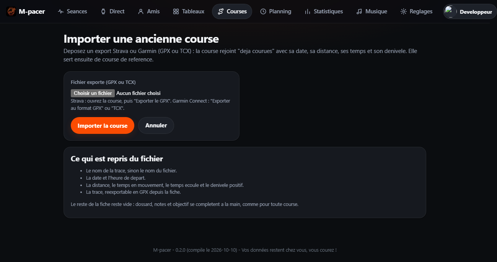

# 05 - Courses a venir : fiches, planning et suivi

Ce document decrit la partie « courses » de l'interface web : ce qu'elle affiche,
comment les donnees sont stockees et quelles decisions ont ete prises.

## 1. Le besoin

Une seance enregistree raconte le passe. Une course a venir demande autre chose :
retrouver vite, le jour J, tout ce qui a ete prepare des semaines a l'avance.

| Element a suivre | Ou il apparait |
|---|---|
| Numero de dossard | carte, fiche, rappel |
| Horaire de depart | carte, planning, fiche |
| Lieu de depart | carte, planning, fiche, lien carte |
| Lien du live (tracking) | carte, fiche, bouton d'acces direct |
| Hotel reserve (nom, adresse, telephone, lien, arrivee, depart) | fiche, planning |
| Rendez-vous de prise de dossard (date, heure, lieu) | planning, fiche |
| Autres solutions pour dormir | fiche |
| Nutrition et ravitaillement | fiche |
| Informations importantes pour la course | fiche |
| Autres informations (transport, accompagnants...) | fiche |
| Elements a preparer, a cocher | carte (progression), fiche, planning |
| Ancienne course de reference (import Strava/Garmin) | liste des courses deja courues, fiche |

## 2. Les trois ecrans

### 2.1 Les cartes des courses (`/courses`)

Une carte par course a venir, avec ce qu'on veut savoir sans rien ouvrir :
compte a rebours en jours, date et lieu, pastilles (dossard, distance, discipline,
hotel reserve ou a confirmer, live disponible), et une barre de progression du suivi
avec le prochain element a faire. En dessous, la liste des courses deja courues ;
celles qui viennent d'un export Strava ou Garmin y portent la pastille
« Reference ».

Un bouton « Importer une course » ouvre le formulaire d'import (section 7) : c'est
la seule facon de remplir une course passee sans la saisir a la main.

### 2.2 Le planning (`/courses/planning`)

L'agenda des echeances a venir, tous types confondus, groupes par mois :

- **Depart** : la date et l'heure de la course ;
- **Dossard** : le rendez-vous de prise de dossard ;
- **Hotel** : l'arrivee et le depart de l'hebergement ;
- **Suivi** : les elements a preparer qui portent une echeance.

Tout est trie chronologiquement : le planning ne montre que ce qu'il reste a faire,
et chaque ligne renvoie a la fiche de la course concernee.

### 2.3 La fiche de course (`/courses/{id}`)

Toutes les informations de la course, en sections : la course, dossard, suivi en
direct, hebergement, autres solutions pour dormir, nutrition, informations
importantes, autres informations, puis le suivi des elements importants.

Chaque champ non renseigne est affiche comme tel (« non renseigne ») : la fiche
montre d'un coup d'oeil ce qu'il reste a completer, au lieu de masquer les trous.

## 3. Le suivi des elements importants

Chaque course est creee avec huit elements par defaut : inscription confirmee,
certificat medical / PPS, dossard retire, hotel reserve, transport reserve, sac de
course prepare, nutrition prevue, lien du live partage. Chacun peut etre coche,
decoche, retire, et complete par d'autres elements propres a la course, avec une
echeance facultative qui le fait apparaitre dans le planning.

Les elements coches restent visibles, barres : c'est la memoire de ce qui a ete fait.

## 4. La carte

Si la latitude et la longitude sont renseignees, la fiche pointe directement sur le
point exact dans OpenStreetMap ([openstreetmap.org](https://www.openstreetmap.org/)) ;
sinon la recherche se fait sur le nom du lieu de depart ou de la ville. Aucune
bibliotheque cartographique n'est embarquee : c'est un lien, pas une carte interactive,
donc aucun script tiers et aucune fuite de donnees vers un service externe.

## 5. L'API

L'API JSON expose les memes donnees, pour la montre ou un futur client mobile :

| Methode | Chemin | Description |
|---|---|---|
| GET | `/api/v1/races` | liste (option `?upcoming=true`) |
| POST | `/api/v1/races` | creation (201, avec les elements de suivi par defaut) |
| GET | `/api/v1/races/{id}` | fiche complete et son suivi |
| PUT | `/api/v1/races/{id}` | mise a jour de la fiche |
| DELETE | `/api/v1/races/{id}` | suppression (le suivi suit par cascade) |
| POST | `/api/v1/races/import` | import d'une ancienne course (corps `multipart/form-data`, fichier GPX ou TCX) |

L'interface web expose le meme import en session navigateur
(`POST /courses/importer`, page `/courses/importer`) et la trace conservee se
telecharge par `GET /courses/{id}/trace.gpx`.

Authentification identique au reste de l'API (`Authorization: Bearer <jeton>`) ou
session du navigateur. Les erreurs gardent le format
`{"error":"code_stable","message":"explication"}`.

Les horodatages sont des millisecondes UNIX, comme partout ailleurs : le client
decide de l'affichage, le serveur ne stocke jamais de date locale.

## 6. Modele de donnees

```text
races(id, user_id, name, start_at_ms, distance_m, discipline, location, start_location,
      bib_number, bib_pickup_at_ms, bib_pickup_location, live_url, registration_url,
      website_url, latitude, longitude, hotel_name, hotel_address, hotel_phone,
      hotel_url, hotel_booked, hotel_check_in_ms, hotel_check_out_ms, lodging_notes,
      nutrition_notes, important_info, notes, goal_time_s, source, is_reference,
      moving_time_s, elapsed_time_s, elevation_gain_m, created_at_ms, updated_at_ms)

race_tasks(id, race_id, user_id, label, due_at_ms, done, done_at_ms, position, created_at_ms)

race_tracks(race_id, user_id, gpx, points, created_at_ms)
```

`source` (`strava`, `garmin`, `gpx`, `tcx`) et `is_reference` ne sont remplis que
par l'import ; une modification ulterieure de la fiche ne les touche pas.
`race_tracks` est la seule trace conservee : elle suit sa course par cascade.

Migrations : `crates/mpacer-api/migrations/0002_races.sql` puis
`0004-references-et-commentaires.sql`, idempotentes et rejouees au demarrage comme
la premiere. `ON DELETE CASCADE` garantit qu'aucun element de suivi ni aucune trace
ne survit a sa course, ni a la suppression du compte.

## 7. Importer une ancienne course (export Strava ou Garmin)

Le passe se remplit aussi depuis l'exterieur : la page `/courses/importer` accepte
un export **GPX** ou **TCX** de Strava ou Garmin Connect.



Le fichier est relu par le coeur Rust (`mpacer_core::race_import`), jamais conserve tel quel : seule la trace
normalisee reste en base, dans `race_tracks`.

| Ce qui est repris | Source dans le fichier |
|---|---|
| Nom | nom de la trace, sinon nom du fichier |
| Date et heure de depart | premier horodatage |
| Distance | distance declaree (TCX), sinon cumul des points (Haversine) |
| Temps en mouvement | portions courues (au moins 1,8 km/h, coupure GPS de plus de 2 min exclue) |
| Temps ecoule | dernier horodatage moins le premier |
| Denivele positif | cumul des montees de la trace |
| Trace | points echantillonnes (2 000 au plus), reexportables en GPX |

La course creee est une **course de reference** : elle rejoint la liste « deja
courues », sa fiche affiche l'origine, les mesures et un bouton de telechargement du
GPX, et elle n'a **aucun element de suivi** — il n'y a plus rien a preparer. Rien
d'autre n'est invente : dossard, notes et objectif restent vides et se completent a
la main, comme pour toute course.

Le FIT binaire n'est pas lu : Strava et Garmin Connect proposent tous deux l'export
GPX ou TCX, qui porte les memes informations. Un fichier illisible revient sur la
page d'import avec un message explicite, et rien n'est enregistre.

## 8. Chercher une course dans le calendrier Finishers

Saisir une fiche a la main est long, et la date, la distance ou les coordonnees se
recopient mal. La page `/courses/recherche` interroge le calendrier
[Finishers](https://www.finishers.com/ou-courir/europe/france) et propose, pour
chaque course trouvee, un bouton **Creer la course** : la fiche s'ouvre
pre-remplie.

### 8.1 D'ou viennent les donnees

La recherche de Finishers est rendue cote navigateur : elle interroge un index
**Typesense** (collection `races` : 36 000 editions publiees, dont 18 600 en
France) avec une cle de lecture publique, livree dans le JavaScript du site.
M-pacer interroge le meme index, en lecture seule et sans analyser de HTML :

```text
GET https://<hote>/collections/races/documents/search
    ?q=marathon&query_by=eventName,city
    &filter_by=countryCode:=FR && months:=4 && raceDistance:>=40000
    &group_by=eventId&group_limit=1&sort_by=boosted:desc,raceDate:asc
X-TYPESENSE-API-KEY: <cle de lecture>
```

| Critere | Filtre envoye a l'index |
|---|---|
| Pays | `countryCode:=FR` (la France par defaut) |
| Region | `level1:=` suivi du nom exact, entre accents graves |
| Departement, ville | `level2:=...`, `city:=...` |
| Discipline | `raceDiscipline:=trail` |
| Mois | `months:=4` |
| Annee | `raceDate:>=<1er janvier> && raceDate:<=<31 decembre>` |
| Distances | `raceDistance:>=40000 && raceDistance:<=50000` (metres) |

Le regroupement par epreuve (`group_by=eventId`) evite les doublons : une course
qui propose plusieurs distances n'apparait qu'une fois, avec la liste de ses
distances. Le tri par defaut est celui du site (mises en avant, puis date) ; la
distance ou la popularite le remplacent au choix.

### 8.2 Ce qui remplit la fiche

| Champ M-pacer | Source |
|---|---|
| Nom | nom de l'epreuve |
| Date | premier jour de l'edition, a minuit heure locale |
| Distance | distance choisie dans la liste, sinon celle mise en avant |
| Discipline | code de l'index, traduit en francais (trail, route, marche...) |
| Ville, lieu de depart | ville de l'epreuve |
| Latitude, longitude | coordonnees publiees |
| Lien d'inscription | page d'inscription, sinon la fiche Finishers |
| Autres informations | adresse de la fiche Finishers : l'origine reste tracable |

Tout le reste — horaire de depart, dossard, hebergement, objectif, notes privees —
reste vide et se complete a la main : rien n'est invente. Rien n'est enregistre
non plus avant la validation du formulaire : le calendrier Finishers reste chez
Finishers, la fiche nait dans M-pacer quand le coureur la valide.

### 8.3 L'API

| Methode | Chemin | Description |
|---|---|---|
| GET | `/api/v1/races/search` | recherche (`q`, `region`, `departement`, `ville`, `discipline`, `mois`, `annee`, `dmin`, `dmax`, `tri`, `page`, `taille`) |
| GET | `/api/v1/races/finishers/{event}` | fiche normalisee d'une epreuve, par son `eventId` |

Les criteres sont exactement ceux du formulaire web ; une valeur illisible est
refusee avec le format d'erreur habituel. Une source injoignable ou desactivee
repond `503 service_unavailable`, et la page web l'affiche sans casser le
formulaire.

### 8.4 Configuration

| Variable | Role |
|---|---|
| `MPACER_FINISHERS_DISABLED=1` | eteint la recherche (aucun appel reseau) |
| `MPACER_FINISHERS_HOST` | hote Typesense (defaut : celui de Finishers) |
| `MPACER_FINISHERS_API_KEY` | cle de lecture (defaut : la cle publique du site) |
| `MPACER_FINISHERS_COLLECTION` | collection interrogee (defaut `races`) |

La cle par defaut est publique : elle est livree dans le JavaScript de
finishers.com et n'autorise que la lecture. Si Finishers la remplace, la nouvelle
se renseigne sans redeployer le code.

## 9. Decisions

- **Un seul formulaire, une seule validation.** Le formulaire web et l'API
  construisent la meme structure `RaceInput`, normalisee puis validee une seule fois :
  aucun ecart possible entre les deux entrees.
- **Les champs vides sont `NULL`, jamais une chaine vide.** L'affichage distingue
  ainsi « non renseigne » de « renseigne vide ».
- **Les liens sont verifies a l'enregistrement** : seuls `http://` et `https://` sont
  acceptes. Sans ce controle, un lien `javascript:` stocke dans une fiche serait
  rendu dans un `href` et deviendrait un script executable au clic.
- **Aucune dependance front supplementaire.** Les pages restent rendues en Rust
  (maud), le CSS est ecrit a la main, et le JavaScript se limite au strict necessaire.
- **Une echeance sans date ne disparait pas** : un element de suivi sans echeance
  reste sur la fiche, simplement il n'encombre pas le planning.
- **La recherche Finishers est une source, pas une copie.** Aucune course n'est
  stockee tant que le coureur ne l'a pas enregistree, et rien n'est complete
  d'office : une fiche pre-remplie est une proposition, pas une verite.
- **Une source externe ne casse jamais la page.** Injoignable ou desactivee, la
  recherche affiche ce qui s'est passe et laisse le formulaire et le reste du site
  utilisables ; l'API repond alors `503` avec un code stable.
