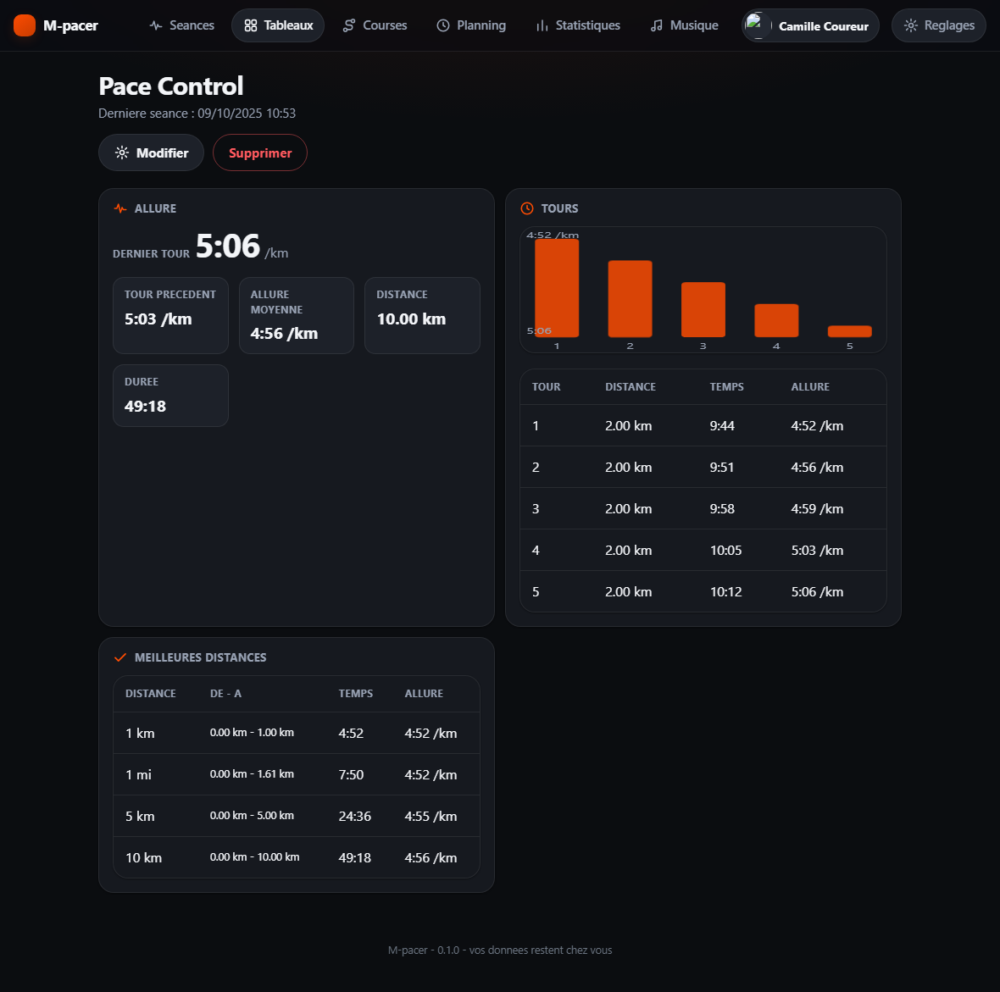
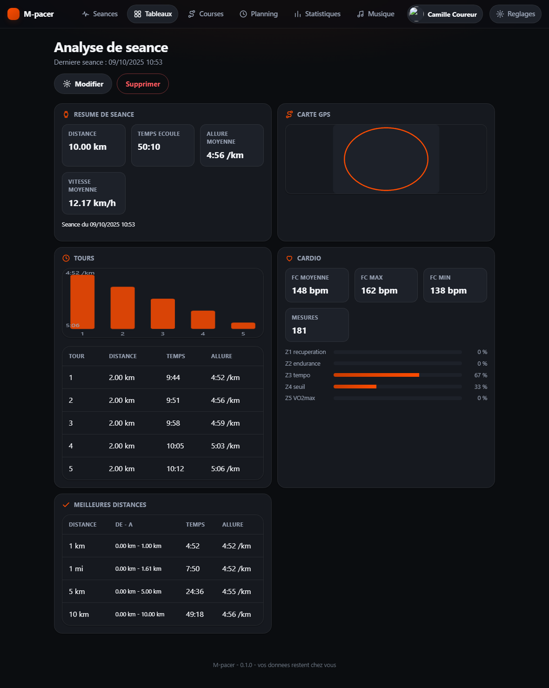
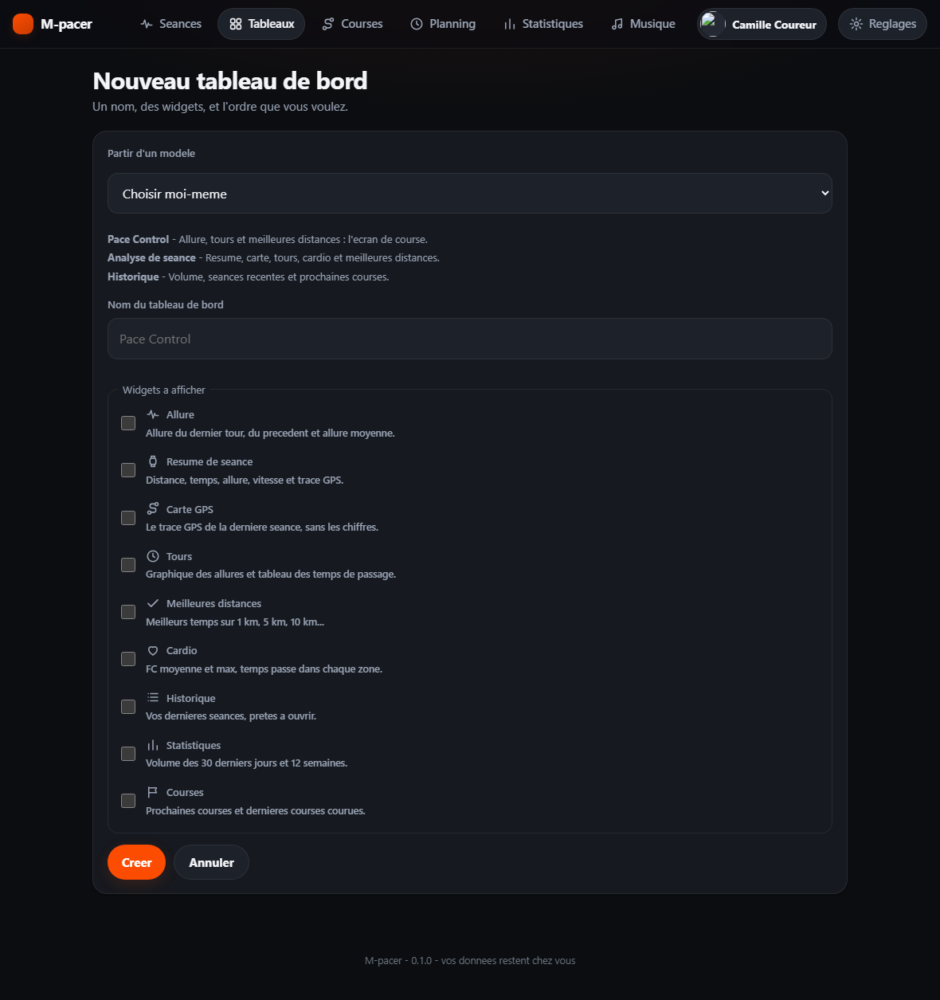

# 08 - Tableaux de bord : composer ses propres écrans

Ce document décrit les **tableaux de bord** de l'interface web : ce qu'ils
apportent, le catalogue des widgets, les gabarits prêts à l'emploi, le modèle de
données et les routes.

## 1. Pourquoi des tableaux de bord

L'application de référence (Pace Control) organise la relecture d'une séance en
écrans fixes : allure courante, résumé avec carte, temps de passage, meilleures
distances, historique, réglages. Ces écrans sont efficaces parce qu'ils répondent
chacun à une question précise, mais ils ne se composent pas : impossible d'afficher
le cardio à côté des temps de passage si c'est ce que l'on regarde.

M-pacer reprend ces écrans **comme des widgets** et laisse le coureur les
assembler. Un tableau de bord est une **liste ordonnée de widgets** :

- il porte un nom libre (« Pace Control », « Ma course du dimanche ») ;
- il contient les widgets choisis, dans l'ordre choisi ;
- il appartient à un utilisateur et n'est visible que par lui ;
- il se modifie en un clic : ajouter, retirer, monter, descendre, renommer.



## 2. Le catalogue des widgets

Neuf widgets sont disponibles. Chacun reprend la mise en page d'un écran de
séance : cartes de chiffres, graphique SVG, tableau. Aucune bibliothèque de
graphiques n'est utilisée — le rendu reste identique partout, y compris sans
JavaScript.

| Clé (persistée) | Libellé | Données utilisées | Contenu |
|---|---|---|---|
| `allure` | Allure | dernière séance | allure du dernier tour, tour précédent, allure moyenne, distance, durée |
| `resume` | Résumé de séance | dernière séance | distance, temps écoulé, allure et vitesse moyennes, date de la séance |
| `carte` | Carte GPS | dernière séance | la trace GPS seule, projetée dans un cadre SVG |
| `tours` | Tours | dernière séance | histogramme des allures par tour et tableau (tour, distance, temps, allure) |
| `meilleures-distances` | Meilleures distances | dernière séance | meilleurs temps 1 km, 1 mi, 5 km, 10 km, semi, avec le tronçon `de - à` |
| `cardio` | Cardio | dernière séance | FC moyenne, max, min, nombre de mesures et temps passé dans chaque zone |
| `historique` | Historique | 12 dernières séances | liste cliquable des séances |
| `statistiques` | Statistiques | 30 jours + 12 semaines | séances, distance, durée, allure moyenne, volume hebdomadaire |
| `courses` | Courses | courses de l'utilisateur | prochaines courses et dernières courses courues |

Deux règles de rendu :

1. **Les données absentes donnent un message, jamais un chiffre inventé.** Pas de
   séance synchronisée, pas de trace GPS ou pas de cardio : le widget l'écrit.
2. **Les données sont chargées selon les widgets présents.** Un tableau qui
   n'affiche que l'historique ne relit pas la trace GPS de la dernière séance.

## 3. Les gabarits

Trois gabarits sont proposés à la création. Ils reproduisent les écrans de
référence en un clic :

| Gabarit | Widgets | Écran reproduit |
|---|---|---|
| **Pace Control** | `allure`, `tours`, `meilleures-distances` | l'écran de course : allure, tours, records |
| **Analyse de séance** | `resume`, `carte`, `tours`, `cardio`, `meilleures-distances` | résumé avec carte, temps de passage, zones FC |
| **Historique** | `statistiques`, `historique`, `courses` | volume, séances récentes, prochaines courses |



Le gabarit est appliqué par le serveur si aucune case n'est cochée : le
formulaire reste utilisable **sans JavaScript**. Quand le script est chargé
(`/static/app.js`), choisir un modèle coche simplement les cases correspondantes.

## 4. Le constructeur

| Page | Rôle |
|---|---|
| `/dashboards` | liste des tableaux de bord, avec leur nombre de widgets |
| `/dashboards/nouveau` | création : nom, gabarit, cases à cocher |
| `/dashboards/{id}` | consultation : la grille de widgets |
| `/dashboards/{id}/modifier` | renommage, ajout, retrait, montée et descente des widgets |

Toutes les actions sont des formulaires `POST` suivis d'une redirection (motif
POST/Redirect/GET) : aucune opération ne dépend du JavaScript, et un rechargement
de page ne rejoue pas une action.



## 5. Modèle de données

Deux tables (`migrations/0005-tableaux-de-bord.sql`), idempotentes comme les
précédentes :

```sql
dashboards        (id, user_id, name, created_at_ms, updated_at_ms)
dashboard_widgets (id, dashboard_id, user_id, kind, position, created_at_ms)
```

Un widget est **une ligne**, pas un document JSON : l'ordre d'affichage est
explicite (`position`), le déplacement échange deux positions, le retrait décale
les suivants, et une clé inconnue reste visible en base au lieu d'être perdue.
Supprimer un tableau supprime ses widgets (`ON DELETE CASCADE`).

## 6. Routes

| Méthode et chemin | Effet |
|---|---|
| `GET /dashboards` | liste des tableaux de bord |
| `GET /dashboards/nouveau` | formulaire de création |
| `POST /dashboards/nouveau` | création (nom + widgets ou gabarit) |
| `GET /dashboards/{id}` | consultation |
| `GET /dashboards/{id}/modifier` | formulaire d'édition |
| `POST /dashboards/{id}/modifier` | renommage |
| `POST /dashboards/{id}/supprimer` | suppression |
| `POST /dashboards/{id}/widgets/ajouter` | ajout d'un widget en fin de tableau |
| `POST /dashboards/{id}/widgets/{widget}/retirer` | retrait |
| `POST /dashboards/{id}/widgets/{widget}/monter` | monte d'un cran |
| `POST /dashboards/{id}/widgets/{widget}/descendre` | descend d'un cran |

Un tableau qui n'appartient pas à l'utilisateur connecté répond `404`, comme
s'il n'existait pas ; le jeton de session reste un cookie `HttpOnly`.

## 7. Code et tests

| Fichier | Contenu |
|---|---|
| `crates/mpacer-api/src/dashboards.rs` | catalogue des widgets, gabarits, chargement des données selon les widgets, rendu |
| `crates/mpacer-api/src/routes/web.rs` | pages et actions du constructeur |
| `crates/mpacer-api/src/db.rs` | requêtes des tableaux de bord et des widgets |
| `crates/mpacer-api/migrations/0005-tableaux-de-bord.sql` | schéma |
| `crates/mpacer-api/static/app.css` | grille `.dash-grid`, widgets, constructeur, courbes SVG |

Tests (avec `MPACER_TEST_DATABASE_URL`) :

- `dashboards::tests::widget_keys_round_trip`, `normalize_drops_unknown_and_duplicate_keys`,
  `templates_only_use_known_widgets` — catalogue et normalisation ;
- `models::dashboard_tests::dashboard_names_are_cleaned_and_bounded` — noms ;
- `dashboard_builder_composes_reorders_and_deletes_widgets` — création depuis un
  gabarit, ordre, montée, ajout, retrait, renommage, suppression ;
- `a_dashboard_belongs_to_its_owner` — un tableau n'est visible et modifiable que
  par son propriétaire.
