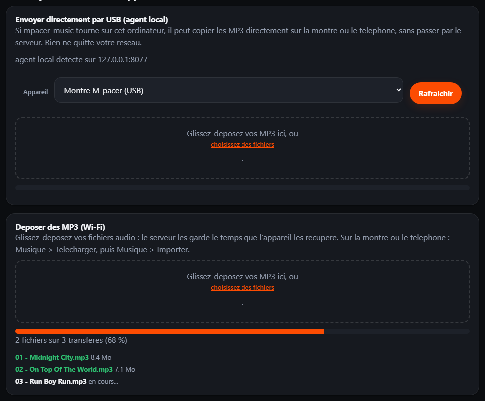

# 16 - Pousser des MP3 depuis le front end vers la montre ou le telephone

> **Statut** : chemins **A et B livres** le 9 octobre 2026. Les decisions sont
> prises : volume audio temporaire accepte sur le serveur, quota **4 Go** par
> compte, 200 Mo par fichier. Le principe « le serveur ne stocke aucun audio » de
> [docs/11](11-playlists-multi-sources-et-synchro-mp3.md) devient conditionnel :
> sans `MPACER_MEDIA_DIR`, rien ne change, et le chemin A n'y touche jamais.

---

## 1. La demande

> « Je veux simplement pouvoir pousser des MP3 depuis le front end de M-pacer, et
> que ces MP3 puissent s'envoyer dans la montre ou dans le telephone. »

Aujourd'hui, la page /music **prepare** la bande-son (Deezer, Deemix, liste des
MP3 attendus, manifeste) et mpacer-music **copie** les fichiers par USB. Il
manque le maillon « je depose mes fichiers dans la page web et ils arrivent sur
l'appareil ».

## 2. Ce qui existe deja (et qu'il ne faut pas reecrire)

| Brique | Etat | Ce qu'elle apporte |
|---|---|---|
| Page /music (crates/mpacer-api/src/routes/web.rs) | 6 blocs, rendus serveur (maud), JS local uniquement | playlist selectionnee, noms de fichiers attendus, manifeste telechargeable (/music/playlists/{id}/manifest) |
| Agent local mpacer-music (crates/mpacer-music) | serveur Axum sur 127.0.0.1:8077 | **push navigateur deja present** (POST /api/library/{playlist_id}?name=...), bibliotheque geree (library.json), appariement, **adb push vers la montre** (POST /api/transfer) |
| Socle Android :core (android/core/.../music/MusicLibrary.kt) | partage montre + telephone | lit context.getExternalFilesDir("Music")/<playlist_id>/manifest.json + les fichiers audio, puis « Importer » |
| Permission reseau | INTERNET fusionnee depuis :core dans la montre **et** le telephone | un telechargement Wi-Fi direct par l'appareil est possible |
| API appareil | GET /api/v1/music/playlists, .../{id}, .../{id}/manifest | deja authentifiee par jeton d'appareil |

Deux faits qui decident de la suite :

1. la montre et le telephone lisent **le meme dossier** Music/ de leur
   application — donc « envoyer sur l'un ou l'autre » = ecrire dans
   /sdcard/Android/data/com.mpacer.watch/files/Music/... **ou**
   /sdcard/Android/data/com.mpacer.phone/files/Music/... ;
2. le serveur est distant (mpacer.p.zacharie.org) : une page servie par le
   serveur ne peut pas ecrire sur un appareil, il faut forcement un **transport**.

## 3. Les deux chemins possibles

| | **A. Passerelle navigateur -> agent local (USB)** | **B. Relais serveur -> telechargement appareil (Wi-Fi)** |
|---|---|---|
| Qui transporte | le PC, par adb push (outil mpacer-music deja en place) | le serveur, puis l'appareil lui-meme |
| Ou va l'audio | disque du PC -> appareil, **jamais** sur le serveur | volume applicatif du serveur, supprime apres acquittement |
| Depuis un navigateur mobile | non (127.0.0.1 n'est pas le PC) | oui |
| Cables | USB + debogage USB | aucun |
| Travail | **petit** (le plus gros existe) | **chantier** (stockage, reprise, service Android) |
| Regle « aucun audio cote serveur » | respectee | abandonnee (assumee, avec expiration) |

Les deux panneaux, tels qu'ils s'affichent dans le bloc 5 de `/music` :



**Recommandation : livrer A d'abord** (1 a 2 jours, aucune decision d'architecture
a revoir), puis B seulement si le besoin « sans cable / depuis le telephone »
apparait. Les deux se completent sans se contredire : A reste le chemin rapide
quand le PC est la, B prend le relais sinon.

---

## 4. Chemin A — « Pousser depuis /music vers la montre ou le telephone »

### 4.1 Principe

```text
Navigateur (page /music servie par le serveur)
   |  fetch vers http://127.0.0.1:8077  (glisser-deposer)
   v
mpacer-music (PC, 127.0.0.1:8077)
   |  GET /api/targets              -> appareils + dossier Music de chacun
   |  POST /api/library/{id}?name=  -> depose le MP3 dans la bibliotheque
   |  POST /api/transfer            -> appariement + adb push vers la cible
   v
Montre     /sdcard/Android/data/com.mpacer.watch/files/Music/<playlist>/
Telephone  /sdcard/Android/data/com.mpacer.phone/files/Music/<playlist>/
```

Le navigateur n'envoie **que** les octets des MP3 et le manifeste JSON de la
playlist ; le serveur M-pacer n'est pas traverse.

### 4.2 Pourquoi ca marche dans un navigateur

* http://127.0.0.1 est une **origine de confiance** pour les navigateurs : une
  page https:// peut l'appeler sans blocage « contenu mixte » ;
* il faut en revanche repondre correctement au **CORS** et, sur Chrome recent, a
  la demande *Private Network Access* (Access-Control-Allow-Private-Network) ;
* Firefox et Safari demandent une autorisation « reseau local » a la premiere
  utilisation ; c'est acceptable pour un outil auto-heberge.

### 4.3 Cote mpacer-music (livre)

1. **Middleware CORS/PNA** (crates/mpacer-music/src/server.rs), avec une
   **liste d'origines autorisees** (--allow-origin URL, repetable ; defaut :
   aucune = outil purement local) :

```text
Access-Control-Allow-Origin: <origine autorisee>
Access-Control-Allow-Methods: GET, POST, DELETE, OPTIONS
Access-Control-Allow-Headers: content-type
Access-Control-Allow-Private-Network: true
Access-Control-Max-Age: 600
```

   plus une reponse 204 a tout OPTIONS avant routage. Le serveur continue
   d'ecouter **uniquement** sur 127.0.0.1.
2. **GET /api/targets** : la liste des appareils adb (/api/devices existe) est
   enrichie du type d'application presente, via
   adb shell pm path com.mpacer.watch / com.mpacer.phone :

```json
{"targets":[{"serial":"...","model":"Pixel Watch","kind":"watch",
             "music_dir":"/sdcard/Android/data/com.mpacer.watch/files/Music",
             "free_bytes":123456789}]}
```

3. **POST /api/transfer** : ajouter le champ watch_dir (le planificateur le porte
   deja dans TransferRequest.watch_dir, seule la route JSON ne l'expose pas). Le
   champ target_dir existant reste la copie locale de test.
4. Rien d'autre a inventer : POST /api/library/{playlist_id}?name=... et la
   pagination des jobs (/api/transfer/{job_id}) existent deja.

### 4.4 Cote page /music (livre)

Dans le **bloc 5 « Transfert vers la montre »**, une zone unique :

```text
+---------------------------------------------------------------------------+
| 5. Transfert vers l'appareil                                              |
|   [x] Agent local detecte (127.0.0.1:8077)     Cible : [Montre v]         |
|   +-------------------------------------------------------------------+   |
|   |  Glissez-deposez vos MP3 ici (mp3, m4a, ogg, opus, flac, wav)     |   |
|   +-------------------------------------------------------------------+   |
|   | 01 - Avicii - Wake me up.mp3   6,4 Mo   [ a synchroniser ]        |   |
|   | 02 - Avicii - Levels.mp3       5,1 Mo   [ synchronise 12:04 ]     |   |
|   [ Envoyer vers la montre ]   barre de progression   [ Annuler ]        |
+---------------------------------------------------------------------------+
```

* detection de l'agent par GET /api/targets avec un **delai court** (~1 s) ;
  s'il est absent, le bloc affiche « Lancez mpacer-music sur le PC » ;
* le manifeste de la playlist selectionnee est recupere par
  fetch('/music/playlists/{id}/manifest') (route existante) puis transmis au
  champ manifest_json de l'agent ;
* chaque fichier est envoye par fetch(POST /api/library/{id}?name=...) en
  application/octet-stream (limite existante de 200 Mo par fichier) ;
* le bouton d'envoi appelle POST /api/transfer avec la cible choisie, puis suit
  /api/transfer/{job_id} ; le statut par fichier affiche vient de
  GET /api/library/{id}.

Le JS vit dans crates/mpacer-api/static/app.js (deja servi par /static/app.js)
pour rester compatible avec la politique « aucune ressource externe ».

### 4.5 Securite

| Risque | Reponse |
|---|---|
| Un site tiers utilise l'agent local | **liste d'origines autorisees** (defaut vide) + --token optionnel a recopier une fois dans la page |
| Ecriture arbitraire sur l'appareil | la bibliotheque est limitee a <root>/<playlist_id>/, noms nettoyes (sanitize_file_name), extensions audio seules |
| Exposition reseau | ecoute 127.0.0.1 uniquement, aucune connexion entrante externe |
| Disque plein | verifier l'espace libre de la cible avant adb push (deja fait par le planificateur) |

### 4.6 Tests

* cargo test -p mpacer-music : preflight CORS (origine autorisee / refusee),
  GET /api/targets, transfert avec watch_dir vers --target-dir (chemin complet
  rejoue sans montre), 200 Mo refuse au-dela de la limite ;
* cargo test -p mpacer-api : la page /music contient le bloc de depot, la cible
  et l'appel a l'agent ;
* bout en bout sans montre : mpacer-music transfer --target-dir alimente par la
  bibliotheque poussee ; avec montre : adb push reel.

### 4.7 Limites

* demande un PC avec adb et un cable (ou adb Wi-Fi) ;
* inutilisable depuis un onglet ouvert sur la montre ou le telephone (127.0.0.1
  designe alors l'appareil lui-meme) — c'est exactement ce que couvre le chemin B.

---

## 5. Chemin B — « Relais serveur puis telechargement par l'appareil »

C'est le chantier deja esquisse en docs/11 section 9. Il ne remplace pas A : il
le complete pour l'usage sans cable.

### 5.1 Configuration et stockage

| Element | Contenu |
|---|---|
| `MPACER_MEDIA_DIR` | racine du volume audio (vide = fonctionnalite eteinte) |
| `MPACER_MEDIA_MAX_FILE_BYTES` | taille maximale d'un fichier (defaut 200 Mo, aligne sur mpacer-music) |
| `MPACER_MEDIA_QUOTA_BYTES` | quota par compte (defaut **4 Go**) |
| Chart | `config.mediaDir` + `persistence` active (PVC `/data`, 6 Gi) |
| Nettoyage | suppression apres acquittement de l'appareil (aucune expiration separee : l'appareil acquitte) |

### 5.2 Base — aucune migration

Le schema de `0003_music.sql` portait deja tout ce qu'il faut :
`music_tracks.storage_path` (chemin relatif a `MPACER_MEDIA_DIR`),
`mime`, `size_bytes` et `downloaded_at_ms`. Un televersement remplit ces
colonnes ; un acquittement les remet a `NULL` et horodate `downloaded_at_ms`.
Aucune table supplementaire, aucune migration : rien a rejouer en production.

### 5.3 Contrats HTTP

| Methode | Chemin | Auth | Role |
|---|---|---|---|
| POST | `/music/playlists/{id}/upload` | session navigateur | multipart (champ `file`) : ecrit sur le volume et associe a la piste dont le nom correspond |
| POST | `/music/playlists/{id}/upload/{track_id}/delete` | session navigateur | retire un fichier du serveur |
| GET | `/api/v1/music/playlists/{id}/files` | jeton d'appareil | liste des MP3 stockes (nom attendu, taille, type MIME) |
| GET | `/api/v1/music/playlists/{id}/manifest?files=1` | jeton d'appareil | manifeste pret pour l'appareil (`file` et `size_bytes` remplis) |
| GET | `/api/v1/music/playlists/{id}/tracks/{track_id}/file` | jeton d'appareil | flux du MP3, `Range` supporte pour la reprise |
| POST | `/api/v1/music/playlists/{id}/ack` | jeton d'appareil | `track_ids` : le serveur supprime les fichiers (corps vide = tous) |

Le manifeste existe deja cote appareil (GET /api/v1/music/playlists/{id}/manifest) :
l'appareil telecharge le manifeste **et** les octets, puis MusicLibrary les relit
tels quels.

### 5.4 Cote Android :core

Nouveau android/core/.../music/MusicDownloader.kt :

1. GET /api/v1/music/uploads?playlist_id= avec le jeton d'appareil ;
2. pour chaque fichier absent ou de taille differente : telecharger dans
   MusicLibrary.usbDirectory(context)/<playlist_id>/<file_name>.part, verifier le
   sha256, renommer ;
3. ecrire/merger manifest.json ;
4. POST .../ack puis MusicLibrary.reload(context) ;
5. verifier l'espace libre avant chaque fichier ; reprendre sur coupure via Range.

Declenchement depuis MusicScreen (montre et telephone) par un bouton
« Telecharger depuis le serveur », execute dans un service de premier plan
dataSync (declaration a ajouter dans le manifest de :core :
FOREGROUND_SERVICE_DATA_SYNC). :core embarque deja OkHttp.

### 5.5 Montre <-> telephone

* **Voie preferee : chaque appareil telecharge pour lui-meme** (la montre a
  INTERNET, en Wi-Fi ou via le relais du telephone) ;
* **repli** : le telephone (application d'appoint, qui maitrise deja le Data
  Layer) pousse les fichiers vers la montre par le Channel API de Wear OS ; c'est
  lent sur Bluetooth et ne se justifie que pour quelques titres — a garder hors du
  premier lot.

### 5.6 Tests

* cargo test -p mpacer-api : depot multipart (nom refuse si non audio, taille
  max, quota), liste par jeton d'appareil, Range, acquittement -> fichier supprime ;
* test d'integration : depot puis lecture du flux avec le jeton d'appareil ;
* Android : test unitaire du calcul de chemin et de la reprise (sans reseau) ;
  verification terrain sur la montre (Wi-Fi coupe puis repris).

### 5.7 Risques

| Risque | Mesure |
|---|---|
| Le volume audio devient une sauvegarde a gerer | expiration courte + suppression a l'acquittement + exclusion du pg_dump |
| Disque du serveur plein | quota par utilisateur, refus en 413 |
| Droits : les MP3 peuvent etre sous licence | fonctionnalite personnelle, aucune redistribution ; rappel dans l'interface |
| Cout de la reprise sur coupure | Range + .part + sha256 |

---

## 6. Plan par etapes

| Etape | Contenu | Effort | Etat |
|---|---|---|---|
| **A1** | CORS/PNA + GET /api/targets + watch_dir dans /api/transfer | 0,5 j | **livre** |
| **A2** | Bloc de depot vers l'agent local dans /music | 0,5 j | **livre** |
| **A3** | Verification bout en bout montre + telephone (USB) | 0,5 j | a verifier sur appareils reels |
| **B1** | Volume + POST `/music/playlists/{id}/upload` + zone de depot du bloc 5 | 1 j | **livre** (sans migration : colonnes deja en base) |
| **B2** | API appareil (files, flux `Range`, ack) | 0,5 j | **livre** |
| **B3** | `MusicDownloader` + bouton « Telecharger (serveur) » (montre et telephone) | 1,5 j | **livre** ; service `dataSync` non ajoute (voir 9.4) |
| **B4** | (option) relais telephone -> montre par Data Layer | 1 j | non requis |

**Ordre conseille : B d'abord** (il supprime le cable et fonctionne depuis
n'importe quel navigateur), puis A si l'on veut eviter de faire transiter les
fichiers par le serveur.

## 7. Decisions prises (9 octobre 2026)

1. **Volume audio temporaire sur le serveur : oui** (chemin B retenu), active par
   `MPACER_MEDIA_DIR`. Un deploiement qui ne renseigne pas la variable garde le
   comportement precedent (aucun audio).
2. **Quota par compte : 4 Go** ; **taille maximale par fichier : 200 Mo** (meme
   plafond que `mpacer-music`).
3. **Formats acceptes** : ceux de `mpacer-music` (mp3, m4a, ogg, opus, flac,
   wav) — la montre lit via Media3/ExoPlayer.
4. **Relais telephone -> montre : pas maintenant.** Chaque appareil telecharge
   pour lui-meme (la montre a `INTERNET`). Le Data Layer reste possible plus tard
   si un cas terrain le justifie.

## 8. Hors perimetre

* telechargement Deezer par M-pacer (le service remet la reference a Deemix, il
  ne telecharge rien) ;
* conversion de format sur le serveur (ffmpeg) ;
* synchronisation des MP3 entre appareils (chaque appareil a sa copie) ;
* lecture en streaming : la montre joue des fichiers locaux, pas du reseau.
---

## 9. Etat d'implementation (9 octobre 2026)

### 9.1 Serveur (crates/mpacer-api)

| Chantier | Fichier | Preuve |
|---|---|---|
| Volume optionnel et plafonds | `src/config.rs` (`MPACER_MEDIA_DIR`, `MPACER_MEDIA_MAX_FILE_BYTES`, `MPACER_MEDIA_QUOTA_BYTES`) | test `media_storage_is_optional_and_bounded` |
| Stockage et chemins surs | `src/media.rs` (cle `<user>/<track>/<nom>`, `resolve` anti-evasion, SHA-256) | tests `only_audio_names_are_accepted`, `storage_keys_stay_inside_the_root`, `write_read_and_remove_round_trip`, `sha256_matches_the_known_empty_digest` |
| Depot navigateur | `POST /music/playlists/{id}/upload` (multipart, session) et `.../upload/{track_id}/delete` | tests `uploaded_files_are_matched_to_their_track`, `the_upload_panel_lists_stored_files_and_a_drop_zone` |
| API appareil | `GET .../files`, `.../manifest?files=1`, `.../tracks/{track_id}/file` (`Range`), `POST .../ack` | tests `a_range_header_is_bounded_to_the_file`, `an_impossible_range_is_refused`, `stored_files_are_named_for_the_watch` |
| Manifeste enrichi | `models::TransferManifest::from_playlist_with_files` et `models::stored_file_name` | test `a_manifest_with_files_names_the_stored_uploads` |
| Interface | bloc 5 de `/music` (zone glisser-deposer, progression, liste « sur le serveur »), `static/app.js`, `static/app.css` | tests unitaires de la page, puis `cargo test --workspace` |

Le quota s'appuie sur `db::music_storage_bytes` (somme des `size_bytes` des
pistes stockees) : un depot au-dela de 4 Go repond `413`, et remplacer un
fichier ne compte jamais deux fois.

### 9.2 Android (:core, :app, :phone)

| Chantier | Fichier | Role |
|---|---|---|
| Telechargement | `android/core/.../music/MusicDownloader.kt` | lit `files`, telecharge avec reprise (`Range` + `.part`), ecrit le manifeste (`?files=1`), acquitte |
| Premier plan | `android/core/.../music/MusicDownloadService.kt` | service `dataSync` + notification de progression : le lot continue ecran eteint |
| Ecran montre | `android/app/.../ui/MusicScreen.kt` | bouton « Telecharger (serveur) » et progression |
| Ecran telephone | `android/phone/.../ui/MusicScreen.kt` | meme bouton, meme etat |

L'appareil doit etre appaire : c'est le jeton de `SyncClient`, le meme que la
synchronisation des seances. Le dossier ecrit est exactement celui de
`mpacer-music` (`getExternalFilesDir("Music")/<playlist_id>/`) : « Importer »
fonctionne identiquement pour ce qui vient du Wi-Fi.

### 9.3 Deploiement

`charts/mpacer` : `config.mediaDir`, `config.mediaQuotaBytes` et
`config.mediaMaxFileBytes` (ConfigMap) ; `persistence` active sur jo3
(`/data/media`, 6 Gi). `.env.example` documente les trois variables. Sans
`config.mediaDir`, la fonctionnalite reste eteinte et aucun octet audio n'est
stocke.

### 9.4 Chemin A (agent local) — livre

| Chantier | Fichier | Role |
|---|---|---|
| CORS et Private Network Access | `crates/mpacer-music/src/server.rs` | autorise l'origine declaree (liste par defaut : localhost:8080, 127.0.0.1:8080, mpacer.p.zacharie.org), repond au preflight, refuse le reste |
| Cibles | `GET /api/targets` | appareils adb + application presente (`pm path`) -> `watch`/`phone` et dossier `Music/` |
| Transfert | `POST /api/transfer` | champ `watch_dir` valide (chemin absolu sous `/Android/data/`) |
| Ligne de commande | `crates/mpacer-music/src/cli.rs` | `--allow-origin URL` (repetable, forme `=` acceptee) |
| Page /music | panneau « Envoyer directement par USB (agent local) » | detection de `127.0.0.1:8077`, choix de l'appareil, depot, progression du job |
| Preuves | `cargo test -p mpacer-music` | preflight autorise/refuse, meme-origine, `/api/targets` sans montre |

### 9.5 Limites connues

* pas d'expiration automatique des fichiers non acquittes : le quota de 4 Go est
  le garde-fou ;
* le chemin A demande que l'agent local ait ete lance avec l'origine de la page
  (`--allow-origin https://mpacer.p.zacharie.org`, deja dans la liste par defaut)
  et un appareil autorise par adb ;
* le telechargement Android est un service de premier plan `dataSync` : il
  survit a l'ecran eteint, mais Android peut le retarder si l'appareil est en
  veille profonde (Doze).

