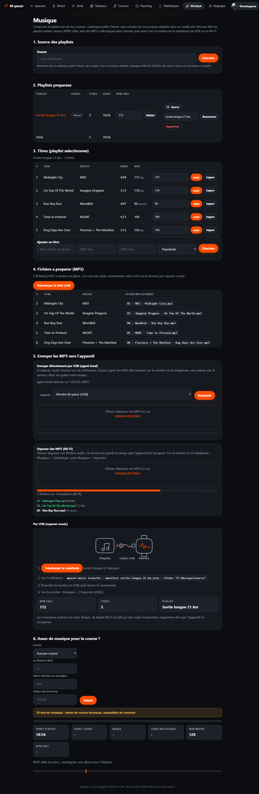

# 17 - Interfaces d'envoi de fichiers (captures)

Trois endroits de M-pacer recoivent un fichier. Ce document les montre tels
qu'ils s'affichent, avec leurs routes, leurs formats acceptes et leurs limites.
Les captures viennent du serveur lance en local (`local-db.ps1 -Action Run`),
page par page, au format 1280 px de large : la meme interface que sur le site
deploye.

| Interface | Ce qu'on y depose | Page | Traitement |
|---|---|---|---|
| Depot des MP3 (agent local USB) | MP3 vers la montre ou le telephone | `/music` (bloc 5) | `mpacer-music` sur le poste, rien ne passe par le serveur |
| Depot des MP3 (Wi-Fi) | MP3 gardes par le serveur | `/music` (bloc 5) | `POST /music/playlists/{id}/upload` |
| Importer une ancienne course | export Strava ou Garmin (GPX, TCX) | `/courses/importer` | `POST /courses/importer` |

Deux autres envois existent, sans formulaire : la synchronisation d'une seance
depuis la montre (`POST /api/v1/workouts`) et le fichier choisi par
l'application d'appoint Android (Data Layer ou partage systeme).

---

## 1. Page Musique : les deux depots de MP3

La page `/music` prepare la bande-son : source des playlists, titres, BPM cible,
puis liste des MP3 a mettre en place. C'est le bloc 5, « Envoyer les MP3 vers
l'appareil », qui porte les deux depots.



Le meme ecran en entier (les six blocs de `/music`).

### 1.1 Agent local en USB (chemin A)

Le panneau se cache tant que `mpacer-music` ne repond pas sur
`127.0.0.1:8077`. Quand l'outil tourne sur l'ordinateur, l'agent annonce les
appareils qu'il voit, on choisit la montre ou le telephone, puis on glisse les
MP3 dans la zone de depot (ou on passe par « choisissez des fichiers »).

### 1.2 Depot Wi-Fi (chemin B)

Le serveur garde les fichiers le temps que l'appareil les recupere :
`Musique > Telecharger` sur la montre ou le telephone, puis `Musique >
Importer`. Chaque piste recue est acquittee, ce qui libere le volume.


La capture montre l'agent local detecte, la cible choisie, la progression d'un
transfert et les fichiers deja arrives.

| Point | Valeur |
|---|---|
| Page | `/music?playlist=<id>` (bloc 5) |
| Route du depot | `POST /music/playlists/{id}/upload` (`multipart/form-data`, champ portant le nom du fichier) |
| Retrait d'un fichier | `POST /music/playlists/{id}/upload/{track_id}/delete` |
| Recuperation par l'appareil | `GET /api/v1/music/playlists/{id}/files` puis `.../tracks/{track_id}/file`, acquittement par `POST .../ack` |
| Extensions acceptees | `mp3`, `m4a`, `ogg`, `opus`, `flac`, `wav` (memes formats que l'outil local et Media3) |
| Taille par fichier | `MPACER_MEDIA_MAX_FILE_BYTES`, 200 Mio par defaut |
| Quota par compte | `MPACER_MEDIA_QUOTA_BYTES`, 4 Gio par defaut |
| Plafond de transport | `crate::media::MAX_UPLOAD_BODY_BYTES` (512 Mio) |
| Condition d'affichage du panneau Wi-Fi | `MPACER_MEDIA_DIR` renseigne, sinon le serveur l'annonce eteint |

Le courant ne se melange jamais : le depot Wi-Fi depose sur le volume du
serveur, l'agent local ecrit directement sur l'appareil par USB. Le detail des
deux chemins est dans [16 - Pousser des MP3 depuis le front end](16-poussee-mp3-front-vers-appareils.md).

---

## 2. Importer une ancienne course (GPX, TCX)

La page `/courses/importer` remplit le passe : un export Strava ou Garmin
suffit, la course rejoint « deja courues » avec sa date, sa distance, ses temps
et son denivele. Elle sert ensuite de course de reference.


| Point | Valeur |
|---|---|
| Page | `/courses/importer` |
| Route de l'envoi | `POST /courses/importer` (`multipart/form-data`, champ portant le nom du fichier) |
| Formats | GPX ou TCX (`.gpx`, `.tcx`, `application/gpx+xml`, `application/xml`) |
| Plafond du corps | `mpacer_core::race_import::MAX_IMPORT_BYTES` (16 Mio), pose sur cette seule route |
| Ce qui est repris | nom de la trace, date et heure de depart, distance, temps en mouvement et ecoule, denivele positif, trace reexportable en GPX |
| Ce qui reste a saisir | dossard, notes, objectif, comme pour toute fiche de course |

Le meme import existe pour un client : `POST /api/v1/races/import` avec un
jeton d'appareil. Voir [05 - Courses a venir](05-courses-et-planning.md) pour
la fiche complete.

---

## 3. Envoi d'une seance depuis les applications

La montre et le telephone n'ont pas de formulaire : le socle `:core` compose la
seance et l'envoie au backend, en arriere-plan, apres la course.

| Point | Valeur |
|---|---|
| Route | `POST /api/v1/workouts` (JSON, `WorkoutUpload`) |
| Authentification | jeton d'appareil (`Bearer`), obtenu par appairage |
| Comportement | idempotent : un renvoi remplace la version precedente |
| Cote application | `SyncClient` (socle), ecran de synchronisation de la montre et du telephone |
| Application d'appoint | choix d'un fichier du telephone, puis envoi vers la montre par le Data Layer (`WearSync`) ou partage systeme |

---

## 4. Reproduire ces captures

Les captures sont prises sur le serveur local, pas sur une maquette :

```bash
pwsh ./local-db.ps1 -Action Start
pwsh ./local-db.ps1 -Action Run        # MPACER_DEV_AUTH=1, http://localhost:8080
# puis, dans le navigateur : /  /courses/importer  /music?playlist=<id>
```

Pour voir les deux panneaux de depot des MP3, lancer le serveur avec un volume
et un agent local :

```bash
$env:MPACER_MEDIA_DIR = 'C:\mpacer-media'
pwsh ./local-db.ps1 -Action Run        # relance le serveur avec le volume
# agent local : mpacer-music sur le poste, http://127.0.0.1:8077
```

Les tests de la page verifient le contenu des panneaux sans navigateur :

```bash
cargo test -p mpacer-api --lib the_upload_panel
cargo test -p mpacer-api --lib the_agent_panel
```

Voir aussi [11 - Playlists multi-sources et synchro des MP3](11-playlists-multi-sources-et-synchro-mp3.md)
et [16 - Pousser des MP3 depuis le front end](16-poussee-mp3-front-vers-appareils.md).
