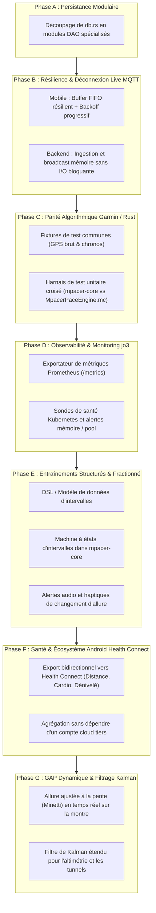

# 18 - Recommandations d'Architecture et Planning d'Évolution

Ce document consigne les recommandations d'architecture issues de la revue technique globale de M-pacer, accompagnées d'un plan de travail priorisé et de la spécification détaillée de chaque phase de développement.

---

## 1. Synthèse de la Feuille de Route (Roadmap Globale)



---

## 2. Développement et Spécification Détaillée des Phases

### Phase A : Découpage de la Persistance (Livré ✅)
- **Objectif :** Remplacer le fichier monolithique `crates/mpacer-api/src/db.rs` (> 2 100 lignes) par une architecture en domaines découplés.
- **Réalisation :**
  - [`db/users.rs`](file:///e:/git/JZacharie/M-pacer/crates/mpacer-api/src/db/users.rs) : Gestion des comptes, profil, recherche et jetons `api_tokens`.
  - [`db/sessions.rs`](file:///e:/git/JZacharie/M-pacer/crates/mpacer-api/src/db/sessions.rs) : Gestion des séances (`workouts`), filtres de dates, totaux hebdos, commentaires et statistiques.
  - [`db/races.rs`](file:///e:/git/JZacharie/M-pacer/crates/mpacer-api/src/db/races.rs) : Courses à venir, courses importées avec GPX et tâches préparatoires.
  - [`db/music.rs`](file:///e:/git/JZacharie/M-pacer/crates/mpacer-api/src/db/music.rs) : Playlists, pistes, quota audio serveur et authentification Deezer.
  - [`db/dashboards.rs`](file:///e:/git/JZacharie/M-pacer/crates/mpacer-api/src/db/dashboards.rs) : Tableaux de bord personnalisés et réordonnancement des widgets.
  - [`db/friends.rs`](file:///e:/git/JZacharie/M-pacer/crates/mpacer-api/src/db/friends.rs) : Amitiés, demandes, codes d'invitation et revendication des appareils live.
- **Validation :** Intégrité préservée, 169 tests unitaires passés.

---

### Phase B : Résilience Live MQTT & Gestion du Mode Déconnecté (Livré ✅)
- **Objectif :** Éviter la perte de positions en zone blanche ou sous-bois sans épuiser la batterie de la montre ou du téléphone.
- **Réalisation :**
  - [`LiveQueue.kt`](file:///e:/git/JZacharie/M-pacer/android/core/src/main/java/com/mpacer/core/live/LiveQueue.kt) : file bornée **par le temps** (20 minutes après le point le plus récent) **et par le nombre** (120 points, réglable). Au-delà, l'historique est **compressé de moitié** (un point sur deux) au lieu d'être tronqué : le tracé garde sa forme et la position courante survit toujours. À l'arrêt, seule la position courante est gardée, pour que le message `stop` parte immédiatement.
  - [`LiveTracker.kt`](file:///e:/git/JZacharie/M-pacer/android/core/src/main/java/com/mpacer/core/live/LiveTracker.kt) : **plus aucune purge à la reconnexion**. Les positions accumulées pendant la coupure repartent en **rafale**, espacées de 50 ms, dès que le broker répond ; aucun espacement n'est ajouté quand la file est vide (cas normal). Le compteur de points abandonnés remonte à l'écran Réglages.
  - [`LiveConfig.kt`](file:///e:/git/JZacharie/M-pacer/android/core/src/main/java/com/mpacer/core/live/LiveConfig.kt) : file par défaut de **120 points** au lieu de 16 — vingt minutes à la cadence de course.
  - [`crates/mpacer-api/src/live.rs`](file:///e:/git/JZacharie/M-pacer/crates/mpacer-api/src/live.rs) : insertion **triée par `t_ms`** dans le `VecDeque<LivePoint>` (`binary_search_by`), date de fin et état publié qui suivent le point le plus récent (et non le dernier message arrivé), même horodatage qui **remplace** le point au lieu de le dupliquer, point de la séance précédente écarté après un `stop`.
- **Validation :** 4 tests d'ingestion désordonnée côté Rust (`out_of_order_points_keep_the_trace_in_time_order`, `a_late_point_does_not_move_the_clock_backwards`, `a_retransmitted_point_replaces_instead_of_duplicating`, `a_late_point_from_a_previous_session_is_ignored`) et 7 tests Kotlin `LiveQueueTest` (fenêtre, compression, arrêt, compteurs) ; les 21 tests du module `live` passent.

---

### Phase C : Tests de Parité Algorithmique (Rust Core vs Garmin Connect IQ)
- **Objectif :** Garantir que l'allure lissée sur 2 minutes, le calcul du tour au kilomètre et l'estimation du shadow runner sont rigoureusement identiques entre Wear OS (cœur Rust natif) et Garmin (Monkey C).

#### 1. Format des Fixtures de Référence (`crates/mpacer-core/tests/fixtures/`)
* Création de jeux d'enregistrements bruts GPS en JSON :
  ```json
  [
    {"t_ms": 1000, "lat": 48.8584, "lon": 2.2945, "acc_m": 4.2, "heart_rate": 142},
    {"t_ms": 2000, "lat": 48.8585, "lon": 2.2946, "acc_m": 3.8, "heart_rate": 145}
  ]
  ```
* Scénarios couverts :
  1. Accélération progressive (changement d'allure de 6:00/km à 4:30/km).
  2. Arrêt brutal / feu rouge (déclenchement de l'auto-pause).
  3. Décrochage GPS tunnel (précision > 50 m, passage du feu au rouge, gel de l'allure lissée).

#### 2. Harnais de Validation Automatisé
* **Côté Rust :** Test d'intégration `tests/garmin_parity.rs` exécutant la séquence sur `PacerEngine` et produisant les métriques de sortie par seconde.
* **Côté Garmin :** Test unitaire Monkey C (`garmin/test/ParityTest.mc`) exécutant la même fixture et comparant :
  - L'allure lissée affichée (tolérance : $\pm 1$ s/km due aux arrondis flottants).
  - La distance cumulée (tolérance : $\pm 0.2\%$).

---

### Phase D : Observabilité & Monitoring de Production (jo3)
- **Objectif :** Instrumenter le backend pour surveiller en temps réel l'utilisation des ressources et la santé du cluster k3s.

#### 1. Endpoint `/metrics` Prometheus (`crates/mpacer-api`)
* Intégration de `metrics` et `metrics-exporter-prometheus`.
* Métriques clés exposées :
  - `mpacer_http_requests_total{handler, code}` : Volume et codes retour HTTP.
  - `mpacer_http_request_duration_seconds` : Latence des requêtes (histogramme).
  - `mpacer_db_pool_active_connections` : Connexions SQLx utilisées par rapport au max (10).
  - `mpacer_active_live_devices` : Nombre de montres et téléphones publiant actuellement.
  - `mpacer_media_storage_bytes` : Espace disque audio occupé par rapport au quota de 4 Go.

#### 2. Intégration Helm & Kubernetes (`charts/mpacer`)
* Ajout d'une ressource `ServiceMonitor` optionnelle pour Prometheus Operator.
* Affinage des seuils de mémoire du Pod :
  - `limits.memory: 256Mi`
  - `requests.memory: 64Mi`

---

### Phase E : Moteur de Séances Structurées (Intervalles & Fractionné)
- **Objectif :** Permettre l'exécution de plans de fractionné avec annonces vocales et haptiques ("30/30", pyramides, seuil).

#### 1. Modèle de Données du Fractionné (`mpacer-core/src/workout/interval.rs`)
```rust
pub enum StepTarget {
    PaceRange { min_s_km: f64, max_s_km: f64 },
    HeartRateZone(u8),
    Open,
}

pub enum StepDuration {
    DistanceMeters(f64),
    TimeSeconds(u32),
}

pub struct WorkoutStep {
    pub name: String,
    pub duration: StepDuration,
    pub target: StepTarget,
}

pub struct IntervalPlan {
    pub warmup: Option<WorkoutStep>,
    pub intervals: Vec<(WorkoutStep, WorkoutStep)>, // (Effort, Récupération)
    pub repetitions: u32,
    pub cooldown: Option<WorkoutStep>,
}
```

#### 2. Transitions et Machine à États
* `PacerEngine` gère la transition automatique d'étape lorsque la distance ou la durée cible est atteinte.
* Émission d'un événement `WorkoutEvent::IntervalStepChanged { index, target }`.
* Rendu dans `VoiceCoach` : annonce "Prochaine étape : 400 mètres à allure 3 minutes 50".

---

### Phase F : Intégration Android Health Connect
- **Objectif :** Synchroniser localement les séances terminées avec l'API standard Android Health Connect (disponible nativement dès Android 14 et rétrocompatible via Play Services sur Android 9+).
- **Problématique résolue :** Permet aux coureurs de retrouver leurs données dans leurs applications de santé préférées (Samsung Health, Google Fit, Withings) sans dépendre d'un compte cloud propriétaire.
- **Spécification technique :**
  1. **Permissions déclarées :** `WRITE_EXERCISE`, `WRITE_DISTANCE`, `WRITE_HEART_RATE`, `WRITE_TOTAL_CALORIES_BURNED`.
  2. **Mapping de données :**
     - Type d'exercice : `ExerciseSessionRecord.EXERCISE_TYPE_RUNNING`.
     - Série temporelle cardio : `HeartRateRecord` dérivé des échantillons du `WorkoutSummary`.
     - Trace GPS : `ExerciseRoute` intégrée dans la session d'exercice.
  3. **Déclenchement :** Exécuté de manière asynchrone dans `TrackingService` lors de l'appel à `WorkoutState::Finished`.

---

### Phase G : GAP Temps Réel & Filtrage Kalman Altimétrique
- **Objectif :** Étendre l'allure ajustée à la pente (GAP - *Grade Adjusted Pace*, modèle Minetti) au temps réel sur la montre et fiabiliser l'altitude barométrique/GPS.
- **Problématique résolue :** En côte ou en trail, l'allure brute chute fortement alors que l'intensité d'effort augmente. Afficher le GAP en direct permet au coureur de doser son effort comme sur terrain plat.
- **Spécification technique :**
  1. **Filtrage de l'altitude :**
     - Fusionner le baromètre de la montre (très réactif aux variations relatives) et le GPS (calibrage absolu) à l'aide d'un filtre de Kalman simplifié à 2 états (altitude, vitesse verticale).
  2. **Calcul GAP temps réel dans `mpacer-core::pace` :**
     - Pente instantanée calculée sur les 30 derniers mètres parcourus : $\text{pente} = \frac{\Delta \text{alt}}{\Delta \text{dist}}$.
     - Facteur Minetti appliqué : $\text{Allure}_{\text{GAP}} = \text{Allure}_{\text{réelle}} \times \frac{C_{\text{plat}}}{C(\text{pente})}$.
  3. **Widget montre :** Nouveau widget optionnel d'affichage "Allure GAP" commutable d'un geste sur l'écran.

---

## 3. Planning d'Exécution & Découpage en Sprints

| Sprint | Contenu / Tâches Principales | Risque | Livrable |
| :--- | :--- | :--- | :--- |
| **Sprint 1** (livré ✅) | **Phase B (Live)** : file de 20 min / 120 points, décharge en rafale, ingestion triée côté backend. | Faible | Trace sans trou à la reconnexion, validée par 11 tests. |
| **Sprint 2** | **Phase C (Garmin)** : Fixtures JSON + Harnais de tests comparés. | Moyen | Rapport de conformité < 0.5% d'écart. |
| **Sprint 3** | **Phase D (Observabilité)** : Route `/metrics` + Sondes k8s sur `jo3`. | Faible | Dashboard Grafana / métriques Prometheus. |
| **Sprint 4** | **Phase E (Fractionné)** : Machine à états Rust + alertes vocales. | Élevé | Support des séances par intervalles dans le moteur. |
| **Sprint 5** | **Phase F (Health Connect)** : Intégration Android Health Connect API. | Moyen | Écriture locale des séances dans le hub santé Android. |
| **Sprint 6** | **Phase G (GAP & Kalman)** : Fusion baromètre/GPS et GAP temps réel. | Moyen | Widget d'allure ajustée à la pente en direct. |

