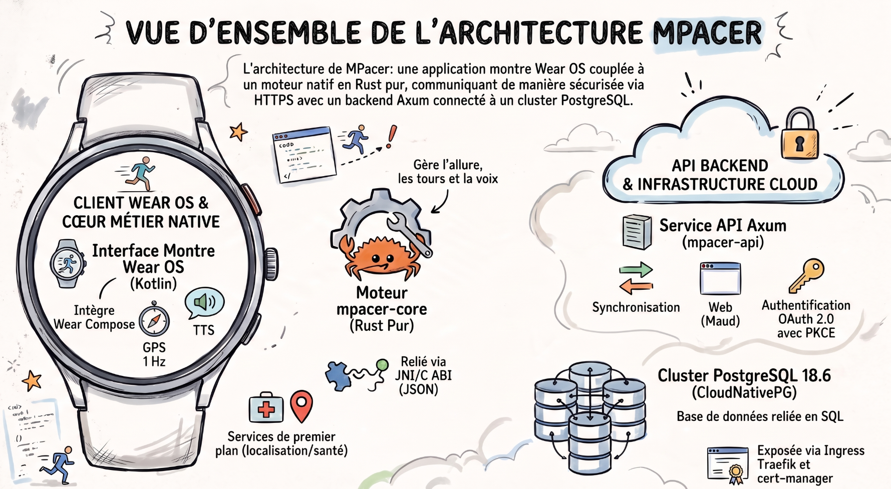

# Documentation M-pacer

Index des documents. Le point d'entrée reste le [README principal](../README.md)
(présentation, plan d'action complet et carte du dépôt).

| Document | À lire si vous voulez… |
|---|---|
| [01 - Analyse des fonctionnalités](01-analyse-features.md) | comprendre ce qui a été repris de Pace Control, pourquoi, et avec quelles priorités (37 fonctionnalités inventoriées, formules du negative split et des meilleures distances) |
| [02 - Architecture Rust / Wear OS](02-architecture-rust-wearos.md) | savoir pourquoi le calcul est en Rust et l'interface en Kotlin, comment fonctionne l'algorithme d'allure sur 2 minutes, quelles permissions sont nécessaires et ce que consomme la batterie |
| [03 - Plan d'action (application montre)](03-plan-action.md) | planifier le travail côté Wear OS : phases, tâches, critères d'acceptation, risques, stratégie de test |
| [04 - Backend, interface web et déploiement](04-backend-web-et-deploiement.md) | comprendre l'API, l'authentification Google, le modèle de données PostgreSQL et l'exploitation du service |
| [05 - Courses à venir : fiches, planning et suivi](05-courses-et-planning.md) | préparer une course : dossard, horaires, lieux, live, hébergement, nutrition, informations importantes et éléments à cocher |
| [06 - Analyse d'une séance](06-analyse-seance.md) | lire un écran d'analyse : veille concurrente (Strava, Garmin, Polar, Coros…), plan contre réalisé, zones de fréquence cardiaque, découplage et temps d'accélération |
| [07 - Musique, BPM et playlists de course](07-musique-bpm-et-playlists.md) | ajouter de la musique à la montre : playlists Spotify ou fichiers personnels, tempo cible, préparation avant une course, contrat d'interface du coeur, de l'API et des écrans |
| [09 - Montre Garmin (Connect IQ, Monkey C)](09-montre-garmin.md) | porter l'application sur une montre Garmin : correspondance module par module avec le cœur Rust, capteurs et FIT, contraintes de mémoire et de réseau, contrat d'API, outillage et vérification |
| [10 - Suivi en direct (MQTT)](10-suivi-temps-reel.md) | suivre la course en temps réel : contrat du sujet et de la charge utile, cadence et filtre de précision sur la montre, page `/live`, budget de ressources chiffré, sécurité et limites |
| [08 - Tableaux de bord](08-tableaux-de-bord.md) | composer vos propres écrans : catalogue de neuf widgets (allure, carte, tours, meilleures distances, cardio, historique…), gabarits Pace Control / Analyse / Historique, modèle de données et routes |
| [Guide de déploiement](../deploy/README.md) | déployer concrètement sur le cluster k3s **jo3** : image, secrets, Helm, ingress, TLS, sauvegardes, dépannage |

## Illustrations

| Image | Contenu |
|---|---|
|  | Vue d'ensemble dessinée : montre Wear OS + cœur Rust embarqué, API Axum, cluster PostgreSQL, Ingress Traefik |
| [Proposition de logo 1 — cible néon](images/logo-mpacer-cible-neon.jpg) | Logo alternatif : cible d'athlétisme et flèche d'allure, dégradé cyan/rose |
| [Proposition de logo 2 — montre verte](images/logo-mpacer-montre-verte.jpg) | Logo alternatif : silhouette de montre et coureur sur courbe de progression, vert |
| [Proposition de logo 3 — montre bleue](images/logo-mpacer-montre-bleue.jpg) | Logo alternatif : montre et flèche de progression, bleu/orange |
| [Tableau de bord « Pace Control »](images/dashboards/pace-control.png) | Écran de course composé dans l'interface web : allure, tours, meilleures distances |
| [Tableau de bord « Analyse de séance »](images/dashboards/analyse.png) | Résumé, carte GPS, tours, cardio et meilleures distances |
| [Création d'un tableau de bord](images/dashboards/nouveau.png) | Constructeur : nom, gabarit, cases à cocher |

La vue d'ensemble est également reprise en tête de
[02 - Architecture Rust / Wear OS](02-architecture-rust-wearos.md). Toutes ces images
sont publiées dans la [galerie interactive](https://jzacharie.github.io/M-pacer/galerie/)
du site (visionneuse plein écran) et reprises par
[08 - Tableaux de bord](08-tableaux-de-bord.md).

## Parcours conseillés

**Je veux juste essayer** → [README § 5](../README.md#5-démarrage-rapide) : `cargo test` puis `mpacer-sim`.

**Je veux comprendre le produit** → 01 (fonctionnalités) puis 02 (architecture).

**Je veux déployer** → [deploy/README.md](../deploy/README.md).

**Je veux reprendre le développement montre** → 03 puis [android/README.md](../android/README.md).

**Je veux déployer sur une montre Garmin** → 09 puis [garmin/README.md](../garmin/README.md).

**Je veux toucher au backend** → 04, puis le code de `crates/mpacer-api/` (chaque module est documenté en tête de fichier).